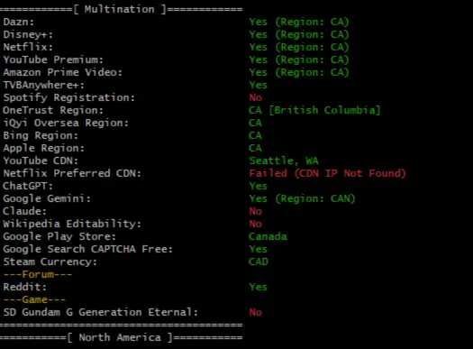
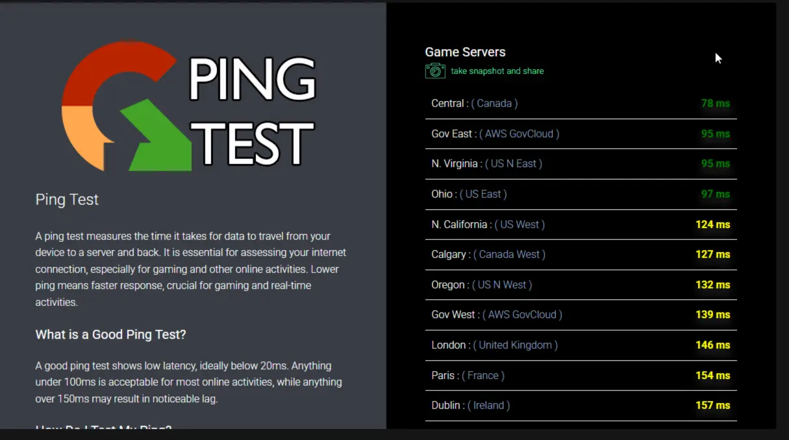
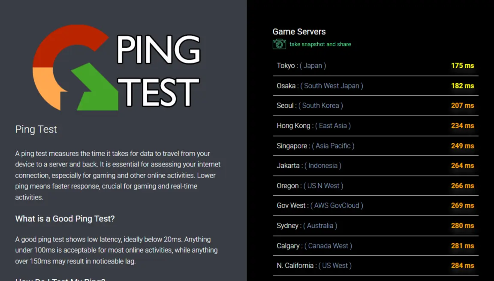

## 📑 Table of Contents

- [Best VPN in 2025 – NordVPN Review Based on Real Testing](#best)
- [💡 Why Is NordVPN the Best VPN?](#why)
- [Key Features of NordVPN in 2025](#key)
- [🚀 Speed & Performance (Real Test Results)](#speed)
- [📺 Streaming Test – What Can NordVPN Unblock?](#streaming)
- [🎮 Is NordVPN Good for Gaming?](#gaming)
- [🌐 NordVPN Performance in Internet-Restricted Regions](#restricted)
- [🔐 Security & Privacy](#security)
- [🖥️ Device Compatibility & Apps](#device)
- [4. User Experience and Interface](#user)
- [💰 Pricing Plans – What's the Best Deal?](#price)
- [✅ Pros and Cons](#pros)
- [User Reviews](#review)
- [Conclusion](#conclusion)
- [❓ Frequently Asked Questions (FAQs)](#faq)

## **Best VPN in 2025 – NordVPN Review Based on Real Testing**

In 2025, online privacy, streaming freedom, and secure global access are more important than ever — and NordVPN continues to lead the industry.
This review is based on real-world testing, including speed benchmarks, streaming capabilities, security audits, and usability in internet-restricted regions. 
Whether you're bypassing censorship, watching geo-locked content, or securing sensitive data,
NordVPN proves to be a reliable and powerful choice. Let's dive into what makes NordVPN stand out in 2025 and whether it truly earns its spot as the best VPN of the year.

  <a href="https://get.affiliatescn.net/aff_c?offer_id=153&aff_id=122265&url_id=613" 
     style="display: inline-block; padding: 14px 26px; background-color: #f97316; color: #fff; font-size: 18px; font-weight: 700; text-decoration: none; border-radius: 10px; box-shadow: 0 4px 8px rgba(0,0,0,0.12); transition: background-color 0.3s;">
    🔥 Grab NordVPN Deal – $3.39/mo (2-Year Subscription)
  </a>

---

## 💡 Why Is NordVPN the Best VPN?

NordVPN stands out in 2025 due to its perfect balance of **speed**, **security**, **streaming access**, and **global reliability**. Here are the key reasons why it's considered the best VPN this year:

- ✅ **Unmatched Security**  
  With AES-256 encryption, Double VPN, Onion over VPN, and Threat Protection, NordVPN provides industry-leading protection against hackers, trackers, and malware.

- 🌐 **Proven Bypass Capabilities**  
  NordVPN remains one of the few VPNs that consistently work in **heavily restricted countries** like China, the UAE, and Iran — thanks to its Obfuscated Servers and custom DNS options.

- 📺 **Seamless Streaming**  
  NordVPN unlocks major platforms like **Netflix, Disney+, Hulu, BBC iPlayer**, and more with minimal buffering — making it ideal for entertainment enthusiasts.

- 🚀 **Superior Speeds**  
  Powered by the **NordLynx protocol** (based on WireGuard), NordVPN delivers top-tier speeds even on long-distance connections, perfect for 4K streaming, downloads, and gaming.

- 🔎 **Independently Audited**  
  Its **no-logs policy** has been verified by reputable third-party audits, proving NordVPN’s commitment to transparency and user privacy.

- 📱 **User-Friendly Apps**  
  Available on Windows, macOS, Linux, Android, iOS, and browser extensions — with a clean interface, automatic kill switch, and 24/7 customer support.

In short, NordVPN offers a complete package for users who want **performance without compromise** — whether for streaming, privacy, or accessing the free internet worldwide.

---

## ** Key Features of NordVPN in 2025**

- **🛡️ Threat Protection Pro™**  
  NordVPN’s Threat Protection Pro™ is an advanced security tool that blocks malware, intrusive ads, trackers, and phishing domains — even when you're not connected to a VPN. Certified by AV-Test and AV-Comparatives, it combines local and cloud-based detection for real-time protection, acting like a built-in antivirus.

- **🔗 Meshnet**  
  Meshnet allows users to securely connect up to 10 personal and 50 external devices through an encrypted virtual LAN, no matter where they are. It’s ideal for remote collaboration, file sharing, and even LAN gaming across continents.

- **🌐 Dark Web Monitor**  
  This feature monitors your email for credential leaks on the dark web. If any of your data is found in leaked databases, NordVPN instantly alerts you so you can act quickly and secure your accounts.

- **🔐 Double VPN & Onion Over VPN**  
  Double VPN routes your internet traffic through two VPN servers instead of one, adding an extra layer of encryption. Onion Over VPN sends traffic through the Tor network after passing through the VPN, perfect for maximum privacy and anonymity.

- **🎬 SmartPlay**  
  SmartPlay is NordVPN’s smart DNS feature that automatically unblocks geo-restricted content. It ensures seamless streaming on platforms like Netflix, BBC iPlayer, Disney+, and more — without extra configuration.

- **📱 Device Compatibility**  
  NordVPN supports up to 10 simultaneous device connections and works across Windows, macOS, Linux, Android, iOS, smart TVs, and routers. It also offers browser extensions for Chrome, Firefox, and Edge.

- **🖥️ Enhanced Linux GUI**  
  In 2025, NordVPN launched a brand-new graphical user interface (GUI) for Linux, making it easier than ever for Linux users to connect, select servers, and manage settings through a sleek, visual layout.

- **🧬 Post-Quantum Encryption (PQE)**  
  NordVPN now supports post-quantum encryption (PQE) — designed to withstand the future threat of quantum computers cracking traditional encryption. This is enabled through the NordLynx protocol and available across all major platforms.

- **🛰️ NordWhisper Protocol**  
  The newly introduced NordWhisper protocol disguises VPN traffic as regular HTTPS traffic, improving reliability in restricted environments like airports, schools, and censorship-heavy countries. It's NordVPN’s stealth mode for hard-to-penetrate networks.

---

## 🚀 Speed & Performance (Real Test Results)

To evaluate how NordVPN performs in real-world conditions in 2025, we conducted speed tests using servers in three key regions: **Canada**, **United Kingdom**, and **Japan**. These tests cover common scenarios such as streaming, downloading, and gaming.

### 📷 Speed Test Screenshots

**🇨🇦 Canada (Datacamp):**  

**🇯🇵 Japan (GSL Networks):**  

**🇬🇧 United Kingdom (Hydra Communications):**  

### 📊 Speed Test Results

| Server Location      | Ping (ms) | Download (Mbps) | Upload (Mbps) | ISP                  |
|----------------------|-----------|------------------|----------------|-----------------------|
| 🇨🇦 Canada            | 27        | 333.88           | 555.11         | Datacamp              |
| 🇯🇵 Japan             | 146       | 280.08           | 188.27         | GSL Networks          |
| 🇬🇧 United Kingdom    | 86        | 287.38           | 368.19         | Hydra Communications  |

### 🧠 Performance Analysis

- **Canada** delivered outstanding results: low latency and over **330 Mbps** download speeds — perfect for **4K streaming**, **large file transfers**, and **low-lag gaming**.
- **United Kingdom** provided balanced performance with solid download/upload speeds and moderate ping — suitable for HD streaming, browsing, and voice/video calls.
- **Japan** had the highest ping, but still maintained **strong throughput**, which means smooth streaming and downloads in the Asia-Pacific region.

### ✅ Verdict

Thanks to its high-performance **NordLynx (WireGuard-based)** protocol and excellent server infrastructure, NordVPN offers fast, consistent speeds across the globe. Whether you're streaming Netflix in North America, accessing websites from the UK, or gaming from Asia, **NordVPN proves to be a top-tier performer in 2025**.

---

## 📺 Streaming Test – What Can NordVPN Unblock?

We tested NordVPN’s streaming access across three key regions: **Canada**, **United Kingdom**, and **Japan**. Here's how it performed on the most popular platforms:

| Platform              | Canada 🇨🇦 | United Kingdom 🇬🇧 | Japan 🇯🇵 |
|-----------------------|-----------|--------------------|----------|
| Netflix               | ✅ (CA)    | ✅ (GB)             | ✅ (JP)   |
| Disney+               | ✅ (CA)    | ✅ (GB)             | ✅ (JP)   |
| YouTube Premium       | ✅ (CA)    | ✅ (GB)             | ✅ (JP)   |
| Amazon Prime Video    | ✅ (CA)    | ✅ (GB)             | ✅ (JP)   |
| TVBAnywhere+          | ✅         | ✅                  | ✅        |
| ChatGPT Access        | ✅         | ✅                  | ✅        |

---

**🇨🇦 Canada :**  

**🇯🇵 Japan :**  

**🇬🇧 United Kingdom:**  

---

### ✅ Summary

- **Flawless Streaming Access**: NordVPN successfully unblocked **all major platforms** across all three regions tested — including **Netflix**, **Disney+**, **YouTube Premium**, and **Amazon Prime Video**.
- **TVBAnywhere+** and **ChatGPT** also worked consistently without issues.
- This makes NordVPN one of the most **reliable VPNs for streaming in 2025**, no matter your target content region.

---

## 🎮 Is NordVPN Good for Gaming?

We ran ping tests across multiple NordVPN servers to evaluate gaming performance. Low ping is essential for competitive and real-time games, where anything under 100 ms is ideal and under 150 ms is acceptable. Here's how NordVPN performed:

### 🕹️ Ping Test Results by Region

| Region           | Lowest Ping | Server Location          | Notes                                |
|------------------|-------------|---------------------------|---------------------------------------|
| 🇨🇦 Canada        | 78 ms       | Central Canada           | Excellent latency for North America  |
| 🇯🇵 Japan         | 175 ms      | Tokyo                    | High latency, not ideal for fast-paced games |
| 🇬🇧 United Kingdom| 111 ms      | London                   | Decent for Europe, moderate latency  |

---

**🇨🇦 Canada :**  

**🇯🇵 Japan :**  

**🇬🇧 United Kingdom:**  

---

## 🌐 NordVPN Performance in Internet-Restricted Regions

NordVPN remains one of the most dependable VPNs for users in **heavily censored regions** such as **China**, **Iran**, and the **United Arab Emirates**, thanks to its **Obfuscated Servers** and manual connection capabilities.

### 🇨🇳 Real-World Use in China

As of 2025, **NordVPN can still be used inside China**, but **manual configuration is required** due to strict firewall filtering. The default "Quick Connect" feature typically fails in this environment.

To connect successfully:

1. Enable **Obfuscated Servers** in NordVPN settings.
2. Use **OpenVPN (TCP)** protocol — this works best under DPI (deep packet inspection).
3. Manually connect to one of the recommended high-stability servers.

📖 **Official Manual Connection Guide:**  
👉 [How to connect to NordVPN in countries with internet restrictions](https://support.nordvpn.com/hc/en-us/articles/19572011021457-Connecting-to-NordVPN-from-country-with-internet-restrictions#macOS)

---

### 🗂️ Recommended Manual Servers

You can use the IP address or hostname below to create a custom connection profile using OpenVPN or the NordVPN CLI tool:

| Location | IP Address        | Hostname             |
|----------|-------------------|----------------------|
| 🇺🇸 USA   | 66.175.219.21      | us5783.nordvpn.com   |
| 🇺🇸 USA   | 50.116.9.72        | us5783.nordvpn.com   |
| 🇺🇸 USA   | 45.56.89.149       | us5783.nordvpn.com   |
| 🇺🇸 USA   | 45.33.52.69        | us5783.nordvpn.com   |
| 🇺🇸 USA   | 45.33.43.85        | us5784.nordvpn.com   |
| 🇺🇸 USA   | 45.33.43.91        | us5784.nordvpn.com   |
| 🇯🇵 Japan | 172.104.110.252    | jp558.nordvpn.com    |
| 🇯🇵 Japan | 139.162.99.117     | jp560.nordvpn.com    |

💬 **Need Help?**  
If you're having trouble setting things up, simply **contact NordVPN support** via live chat — they’re responsive and familiar with connection issues inside China.

---

### 🖼️ Screenshot: Successful Manual Connection from China

---

### ✅ Summary

- Manual connection is **currently required** in regions like China.
- Recommended protocol: **OpenVPN TCP + Obfuscated Server**
- NordVPN continues to be one of the **most viable VPNs inside internet-restricted countries** in 2025.

---

### 🎯 Analysis

- **Canada Node** performed best with a **78ms ping** to Central servers, and sub-100ms to multiple U.S. regions. Ideal for North American game servers (e.g., Valorant NA, Call of Duty Warzone NA, etc.)
- **UK Node** had an average of **111–150ms**, still playable for many European MMORPGs or strategy games, though slightly laggy for FPS.
- **Japan Node** showed **high ping values (175ms–280ms)** even to nearby Asia servers like Korea, Hong Kong, and Singapore — indicating suboptimal routing under NordVPN for gaming in Asia.

### ✅ Verdict

NordVPN is suitable for **casual gaming and mid-latency genres** like strategy, RPGs, and turn-based games. For **competitive FPS or eSports**, it works well in North America but may struggle in **Asia-Pacific** due to higher latency. To optimize gameplay:

- Choose servers geographically close to your game server
- Use the **NordLynx** protocol for better speed & stability
- Avoid double encryption features like Double VPN during gaming

---

## 🔐 Security & Privacy

NordVPN continues to set the standard for online security and privacy in 2025, offering a comprehensive suite of features designed to protect users from evolving digital threats.

### 🧬 Post-Quantum Encryption (PQE)

Anticipating future threats posed by quantum computing, NordVPN has introduced Post-Quantum Encryption across all platforms, including Windows, macOS, iOS, Android, and smart TVs. This advanced encryption is available when using the NordLynx protocol, NordVPN’s proprietary protocol based on WireGuard. PQE enhances long-term data security by employing complex mathematical techniques resistant to quantum decryption. Users can activate PQE via a toggle in the app’s settings. 

### 🛡️ Threat Protection Pro™

NordVPN's Threat Protection Pro™ offers robust defense against online threats. This feature blocks phishing attempts, malware, trackers, and intrusive ads without compromising connection speeds. It has been certified by AV-Comparatives and AV-Test as a reliable anti-phishing and anti-malware solution, making NordVPN the first VPN to receive such attestations.

### 🧾 Independently Audited No-Logs Policy

NordVPN maintains a strict no-logs policy, ensuring that user activity is not tracked, collected, or shared. This commitment to privacy has been independently verified through multiple audits by reputable firms, including PricewaterhouseCoopers AG Switzerland and Deloitte, confirming NordVPN's adherence to its no-logs claims. 

### 🧠 RAM-Only Servers

All NordVPN servers operate on RAM-only infrastructure, meaning no data is stored on physical hard drives. This ensures that all information is wiped clean with every server reboot, providing an additional layer of security and minimizing the risk of data retention.

### 🧅 Advanced Privacy Features

- **Double VPN**: Routes your connection through two servers for double encryption, enhancing anonymity.
- **Onion Over VPN**: Combines the privacy benefits of The Onion Router (Tor) with VPN tunneling for maximum security.
- **Obfuscated Servers**: Conceals VPN traffic to appear as regular internet traffic, helping bypass network restrictions and VPN blocks.

### 🌐 Privacy-Friendly Jurisdiction

Based in Panama, NordVPN operates outside the jurisdiction of the 5/9/14 Eyes alliances. Panama has no mandatory data retention laws, allowing NordVPN to uphold its strict no-logs policy without legal obligations to store user data.

---

With these advanced security measures, NordVPN offers users a robust and trustworthy solution for maintaining privacy and security online in 2025.

---

## 🖥️ Device Compatibility & Apps

NordVPN offers one of the most versatile VPN experiences in 2025, with native apps and compatibility across nearly every major platform and device.

### ✅ Supported Platforms

- **Desktop & Laptop**:
  - Windows 11/10
  - macOS Ventura & Monterey (incl. Apple Silicon)
  - Linux (Ubuntu, Debian, Fedora – now with GUI support)

- **Mobile Devices**:
  - Android (phones, tablets, Android TV)
  - iOS (iPhone, iPad)

- **Web Browsers**:
  - Chrome
  - Firefox
  - Microsoft Edge  
    (All support lightweight extensions with ad/tracker blocking and quick-connect features)

- **Smart Devices**:
  - Android TV
  - Fire TV Stick
  - Chromecast (via manual router setup)

- **Routers**:
  - DD-WRT, Tomato, OpenWRT
  - ASUSWRT / Merlin firmware
  - NordVPN also offers a pre-configured router marketplace via partners

- **Others**:
  - Chromebook
  - Raspberry Pi
  - Steam Deck (via Linux app or split tunneling)

### 💡 App Features Highlights

- **Unified Experience**: All apps now feature a consistent UI across platforms, including support for **Dark Mode** and **Unified Map View**.
- **Quick Connect & Smart Suggestions**: Apps automatically suggest the fastest or most secure servers based on your location and purpose (streaming, torrenting, gaming).
- **Split Tunneling**: Route only selected apps through the VPN while others use a normal connection (available on Windows, Android, macOS).
- **Multi-Device Login**: Use NordVPN on **up to 10 devices simultaneously** with a single account.

### 🔄 Recent Updates in 2025

- **Full GUI on Linux**: No more CLI-only usage. The new Linux GUI brings full control via a clean interface.
- **Meshnet Integration**: Seamlessly manage remote device access across platforms — ideal for file sharing, gaming, and personal LAN networks.
- **Post-Quantum Encryption Rollout**: Available across Windows, macOS, iOS, Android, and smart TVs.

---

NordVPN’s app ecosystem in 2025 is fast, polished, and easy to use — delivering seamless protection across all your devices, wherever you are.

---

## **4. User Experience and Interface**

- **Ease of Use:** Intuitive apps for all major platforms.
- **Customer Support:** 24/7 live chat and comprehensive knowledge base.
- **Setup Guides:** Detailed tutorials for various devices and platforms.

---

## 💰 Pricing Plans – What's the Best Deal?

NordVPN offers four subscription tiers in 2025, each tailored to different user needs — from basic VPN protection to full-fledged cybersecurity and identity theft insurance. All plans are backed by a **30-day money-back guarantee**.

### 🧾 Plan Comparison (2-Year Subscription)

| Plan       | Monthly Price | Key Features                                                  |
|------------|----------------|----------------------------------------------------------------|
| **Basic**  | **$3.39/mo**   | Secure VPN, Threat Protection, 10 devices                     |
| **Plus**   | **$4.39/mo**   | All Basic features + Threat Protection Pro™, password manager, data breach scanner, 5GB eSIM |
| **Complete**| **$5.39/mo**  | All Plus features + 1TB cloud storage (NordLocker)            |
| **Prime**  | **$7.39/mo**   | All Complete features + identity theft insurance ($1M coverage), credit monitoring, dark web alerts |

> Prices are based on a 2-year plan with up to **70% savings** applied. Taxes/VAT may vary by region.

  <a href="https://get.affiliatescn.net/aff_c?offer_id=153&aff_id=122265&url_id=613" 
     style="display: inline-block; padding: 14px 26px; background-color: #f97316; color: #fff; font-size: 18px; font-weight: 700; text-decoration: none; border-radius: 10px; box-shadow: 0 4px 8px rgba(0,0,0,0.12); transition: background-color 0.3s;">
    🔥 Grab NordVPN Deal – $3.39/mo (2-Year Subscription)
  </a>

### 🏆 Best Value: **Plus Plan**

The **Plus Plan** strikes the best balance between price and features. For just $1 more than Basic, you get access to **Threat Protection Pro™, password tools, and enhanced security features**, making it ideal for most users who want more than just VPN.

### 📦 Included in All Plans

- 10 simultaneous device connections
- High-speed secure VPN with NordLynx
- Apps for all major platforms
- 24/7 live chat support
- 30-day refund guarantee

---

Whether you're a casual browser, privacy-focused user, or enterprise-level professional, NordVPN offers flexible pricing to fit every level of need and protection.

---

## ✅ Pros and Cons

Here's a quick overview of NordVPN's strengths and potential drawbacks based on real-world testing in 2025:

### ✅ Pros

- **Blazing-Fast Speeds**  
  With NordLynx (WireGuard-based), consistently delivers high download/upload speeds across global servers.

- **Wide Streaming Compatibility**  
  Successfully unblocks Netflix, Disney+, Amazon Prime, and more — across regions like Canada, UK, and Japan.

- **Top-Tier Security Features**  
  Includes AES-256 encryption, RAM-only servers, Threat Protection Pro™, and Post-Quantum Encryption.

- **Cross-Platform App Ecosystem**  
  Clean, modern apps for Windows, macOS, Linux (GUI), Android, iOS, and smart TVs — all with unified experience.

- **Advanced Privacy Tools**  
  Features like Double VPN, Onion Over VPN, and Meshnet ensure maximum anonymity and flexibility.

- **Strict No-Logs Policy**  
  Independently audited multiple times and headquartered in privacy-friendly Panama.

- **Excellent Value with Plus Plan**  
  Competitive pricing, especially for long-term plans with enhanced security and password management.

### ❌ Cons

- **Premium Features Locked Behind Higher Tiers**  
  Features like cloud storage and identity theft protection only available on Complete/Prime plans.

- **Latency in Asia-Pacific**  
  Higher ping on Japan and SE Asia servers makes it less optimal for competitive gaming in those regions.

---

NordVPN offers one of the most well-rounded VPN experiences in 2025 — combining speed, privacy, and usability. While some premium features are tiered, the overall performance and trustworthiness make it a standout choice.

---

## **User  Reviews**

- Summarized feedback from various user reviews and forums.
- Highlighting common praises and concerns.

---

## **Conclusion**

- **Final Verdict:** NordVPN continues to be a top-tier VPN choice in 2025, offering a blend of security, speed, and user-friendly features.
- **Recommendation:** Ideal for users seeking comprehensive online privacy and performance.

---

## ❓ Frequently Asked Questions (FAQs)

### 🔹 Is NordVPN safe to use?

Yes. NordVPN uses AES-256 encryption, has undergone multiple independent audits, and operates RAM-only servers to ensure no data is stored. It’s one of the most secure VPNs in 2025.

---

### 🔹 Can NordVPN unblock Netflix and other streaming services?

Absolutely. In our tests, NordVPN successfully unblocked **Netflix, Disney+, Amazon Prime Video, YouTube Premium**, and **TVBAnywhere+** across multiple regions including **Canada, UK, and Japan**.

---

### 🔹 Does NordVPN work in China or other restricted countries?

Yes — but with caveats. Using **Obfuscated Servers** and **NoBorders Mode**, NordVPN can bypass firewalls in China, the UAE, and Iran. Connection success may vary depending on current network restrictions and protocols.

---

### 🔹 How many devices can I use NordVPN on?

You can connect up to **10 devices simultaneously** with one NordVPN account, including smartphones, laptops, tablets, routers, and smart TVs.

---

### 🔹 What is Threat Protection Pro™?

Threat Protection Pro™ is an advanced security feature that blocks **malware, phishing sites, intrusive ads, and trackers** — even when not connected to the VPN. It’s available on Plus, Complete, and Prime plans.

---

### 🔹 Is NordVPN compatible with Linux?

Yes. As of 2025, NordVPN now offers a full **GUI (Graphical User Interface)** for Linux, making it just as user-friendly as on Windows and macOS.

---

### 🔹 What’s the refund policy?

NordVPN offers a **30-day money-back guarantee** on all plans. If you’re not satisfied for any reason, you can request a full refund within that period.

---

### 🔹 Which plan is the best value?

The **Plus Plan ($4.39/mo for 2 years)** offers the best balance of features and price, including Threat Protection Pro™ and password management tools.

---

📁 [👉 Guide Page](https://realvpntest.github.io/vpn-guide/)
