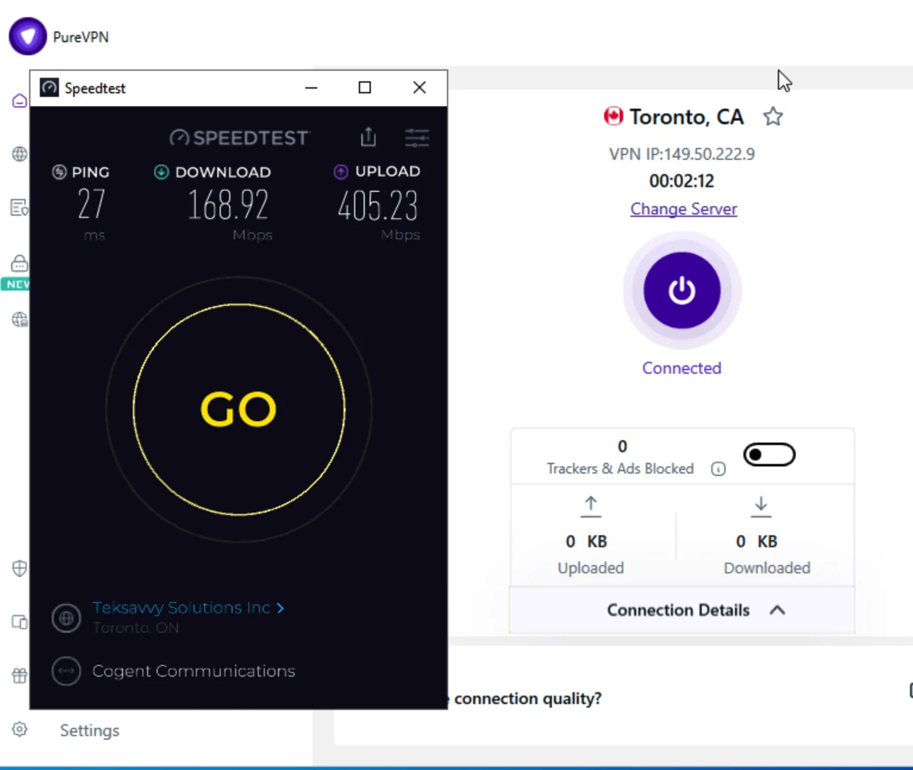
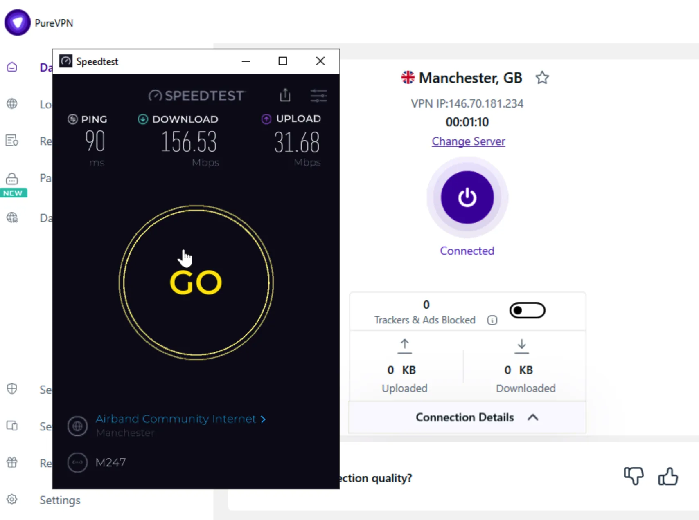
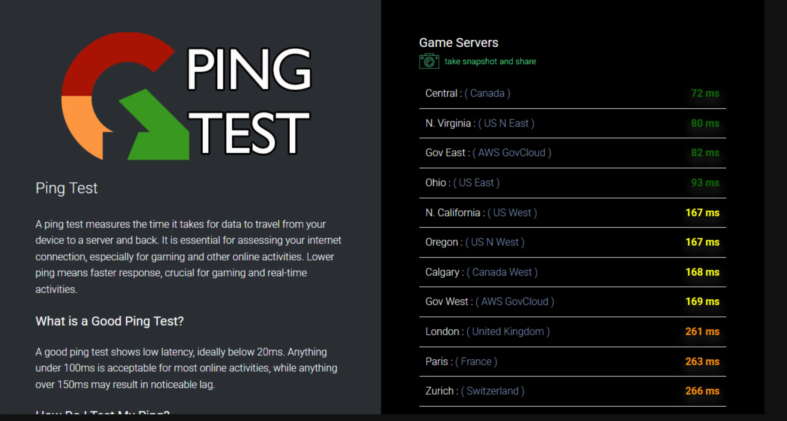
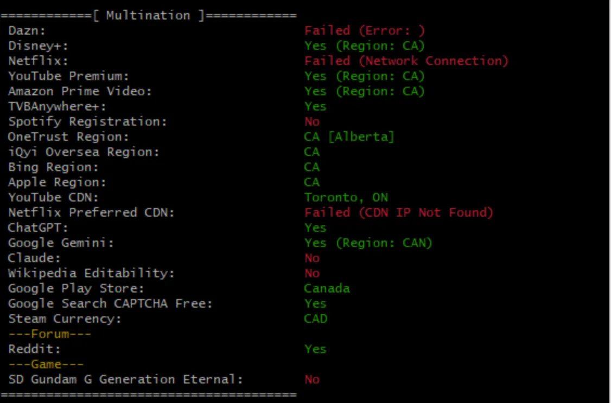
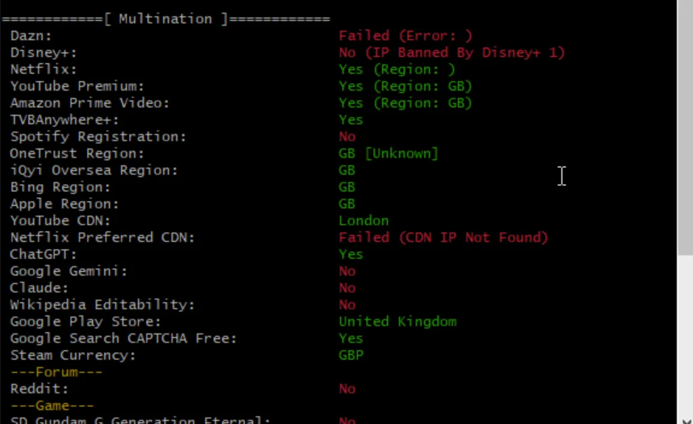
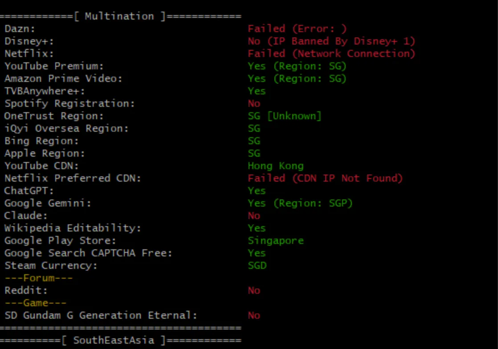
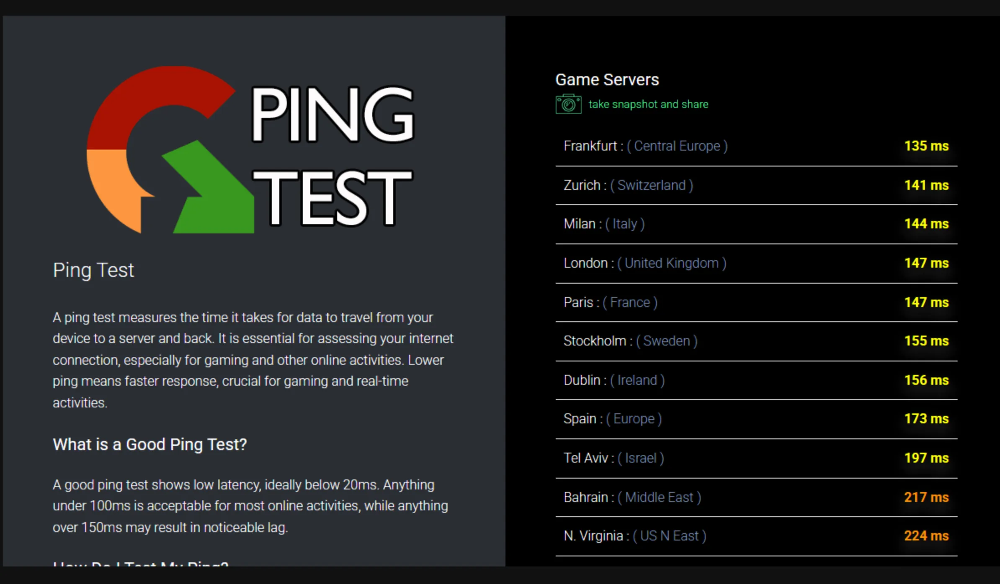
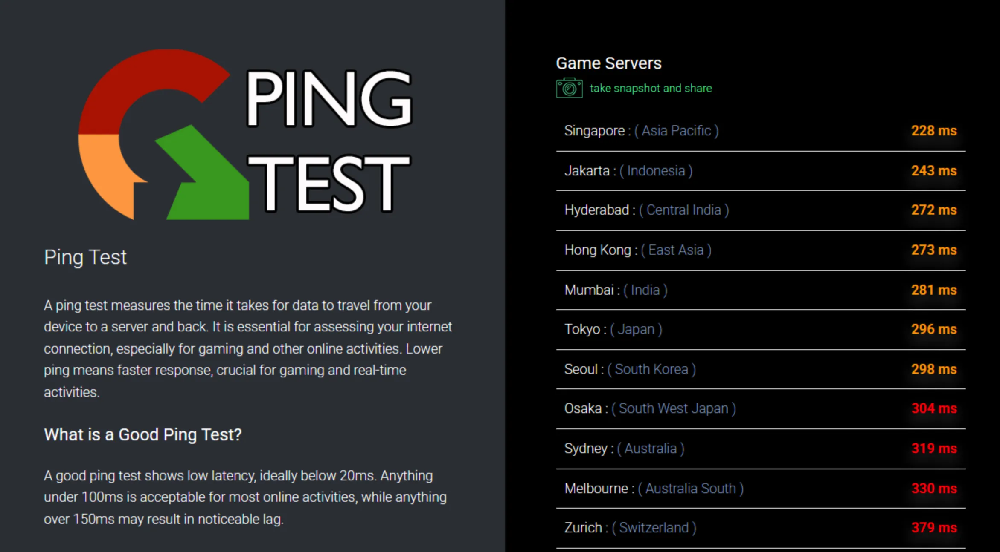
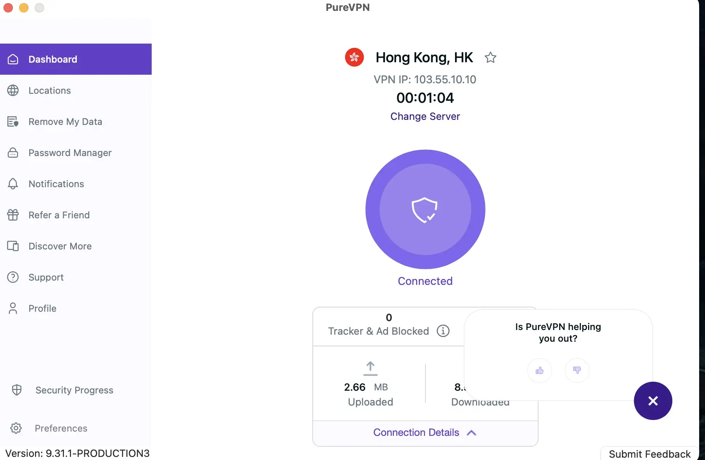

## 📚 Table of Contents

- [🛡️ PureVPN in 2025: A Comprehensive Overview](#overview)
- [💡 Key Features and Innovations](#features)
- [🚀 Speed & Performance: Real-World Testing](#speed)
- [📺 Streaming Capabilities: What Can PureVPN Unblock?](#streaming)
- [🎮 Gaming Experience with PureVPN](#gaming)
- [🌐 PureVPN's Performance in Restricted Regions](#restricted)
- [🔐 Security & Privacy Measures](#security)
- [🖥️ Device Compatibility & Applications](#compatibility)
- [📞 Customer Support & Refund Policy](#support)
- [💰 Pricing Plans & Value Proposition](#pricing)
- [✅ Pros and Cons](#pros-cons)
- [🏁 Final Verdict: Is PureVPN Right for You in 2025?](#verdict)
- [❓ Frequently Asked Questions](#faq)

---

## 🛡️ PureVPN in 2025: A Comprehensive Overview 

PureVPN has been a notable player in the VPN industry since 2007. In 2025, it boasts over 6,500 servers across 78+ countries, offering users a broad range of options for secure and private internet access. With a focus on affordability, streaming capabilities, and enhanced security features, PureVPN aims to cater to both casual users and privacy enthusiasts.

> Note: All my testing was done at my home in Los Angeles.

  <a href="https://billing.purevpn.com/aff.php?aff=49386641" target="_blank" rel="noopener noreferrer" style="background-color:#ffc107; color:#212529; padding:10px 20px; border-radius:5px; text-decoration:none; font-weight:bold;">
     🔥 Grab PureVPN Deal – $2.14/mo (2-Year Subscription)
  </a>

 

---

## 💡 Key Features and Innovations 

- **Extensive Server Network**: Over 6,500 servers in 78+ countries.
- **Multi-Platform Support**: Compatible with Windows, macOS, Linux, Android, iOS, and browser extensions.
- **Advanced Security Protocols**: Supports OpenVPN, IKEv2, and WireGuard.
- **Split Tunneling**: Route some traffic through VPN while allowing other apps direct access.
- **Kill Switch**: Prevents data leaks during connection drops.
- **Dedicated IP and Port Forwarding**: Optional features for advanced needs.

---

## 🚀 Speed & Performance: Real-World Testing 

PureVPN delivers decent speed results, especially on nearby servers. However, performance consistency may vary depending on distance and server load. Here's what our real-world testing revealed:

### 🇨🇦 Canada Server - Toronto

- **Ping**: 27 ms
- **Download Speed**: 168.92 Mbps
- **Upload Speed**: 405.23 Mbps

Performance on the Canadian server (Toronto) is excellent. With low latency and strong bandwidth, it's well-suited for HD streaming, video conferencing, and even competitive online gaming.

---

### 🇬🇧 UK Server - Manchester

- **Ping**: 90 ms
- **Download Speed**: 156.53 Mbps
- **Upload Speed**: 31.68 Mbps

On the UK server (Manchester), latency increases due to distance, but download speeds remain solid. This server is reliable for accessing UK-specific services like BBC iPlayer and UK Netflix.

---

### 🌐 Multi-Region Ping Comparison

Ping tests show favorable latency to North American regions such as **Virginia (80 ms)**, **Ohio (93 ms)**, and **Central Canada (72 ms)** — all within acceptable ranges for smooth browsing and streaming. However, latency spikes above **160 ms** to West Coast U.S. (California, Oregon) and over **260 ms** in Europe (London, Paris, Zurich) may impact performance for latency-sensitive tasks like gaming.

---

### ✅ Verdict

PureVPN shows **strong speed on local and North American servers**, with **reliable streaming** performance and **good upload capacity**. However, **latency increases on distant servers**, which may affect real-time apps like online games or VoIP.

If you're primarily targeting **North American content or need solid upload performance**, PureVPN is a capable choice. For **globally consistent low-latency needs**, especially in Asia or Europe, top-tier competitors may provide more stability.

---

## 📺 Streaming Capabilities: What Can PureVPN Unblock? 

PureVPN offers mixed results when it comes to streaming — some regions perform well, while others encounter restrictions or CDN-related issues. Below are real-world media unlock tests across three major regions:

---

### 🇨🇦 Canada Media Unlock Test

- ✅ **Disney+**, **YouTube Premium**, **Amazon Prime Video**, **TVBAnywhere+** — All accessible (Region: CA)
- ✅ **ChatGPT**, **Google Gemini**, **YouTube CDN** — Available
- ❌ **Netflix CDN** Failed to resolve optimal CDN IP
- ❌ **Claude**, **Wikipedia Editing** — Not available

**Verdict**: Great for Canadian content with smooth playback on major platforms. Netflix CDN issues may affect stream quality at times.

---

### 🇬🇧 United Kingdom Media Unlock Test

- ✅ **Netflix**, **YouTube Premium**, **Amazon Prime Video**, **TVBAnywhere+**
- ✅ **ChatGPT** and **Google Play Store**
- ❌ **Disney+** (Blocked by IP), **Claude**, **Gemini**, **Wikipedia Editing**
- ❌ **Netflix CDN** failed to identify optimized node

**Verdict**: Good for accessing UK-exclusive platforms like BBC iPlayer and UK Netflix. But streaming quality may be unstable due to CDN errors. Disney+ blocked on this server.

---

### 🇸🇬 Singapore / Southeast Asia Media Unlock Test

- ✅ **YouTube Premium**, **Amazon Prime Video**, **TVBAnywhere+**, **Google Gemini**, **ChatGPT**
- ✅ **Google Play**, **Wikipedia Edit**, **Steam Region**
- ❌ **Netflix** and **Disney+** blocked or failed
- ❌ **Claude**, **Netflix Preferred CDN** errors

**Verdict**: Solid for Asian platforms and general browsing. Netflix and Disney+ access is unreliable in this region.

---

### 📝 Summary

PureVPN works well with **YouTube Premium, Amazon Prime Video**, and **regional Google services** across most servers. However, **Netflix CDN issues** and **Disney+ blocks** appear frequently, especially in the UK and Asia.

> ✅ **Best for**: YouTube, Prime Video, regional Google services  
> ⚠️ **Not ideal for**: Netflix binge-watchers or Disney+ fans across all regions

If you're a streamer focused on **YouTube or Amazon**, PureVPN is a solid budget-friendly pick. For full **Netflix or Disney+ unlock reliability**, consider top-tier alternatives.

---

## 🎮 Gaming Experience with PureVPN 

PureVPN offers features like **DDoS protection** and **port forwarding**, making it a decent option for online gamers. However, real-world latency tests show varied results depending on your selected region.

---

### 🇨🇦 North America Gaming Ping Test

- ✅ **Best Latency**: Central Canada (72 ms), US East (80–93 ms)
- ⚠️ **Moderate Lag**: West Coast servers like California & Oregon (~167 ms)
- ❌ **High Latency**: Europe zones exceed 260 ms

**Verdict**: Great performance for North American gamers. Servers are fast and responsive for competitive gameplay.

---

### 🇪🇺 Europe Gaming Ping Test

- ✅ **Acceptable Latency**: Frankfurt (135 ms), Zurich (141 ms), Milan (144 ms)
- ⚠️ **Mild Lag**: Stockholm, Dublin, and Paris (147–156 ms)
- ❌ **High Latency**: Spain, Israel, Bahrain (173–224 ms)

**Verdict**: Playable in most of Europe for casual games, but latency may not be ideal for fast-paced eSports titles.

---

### 🌏 Asia-Pacific Gaming Ping Test

- ⚠️ **Elevated Latency**: Singapore (228 ms), Japan (296 ms), Seoul (298 ms)
- ❌ **Unplayable Zones**: Australia (330+ ms), Zurich (379 ms)

**Verdict**: PureVPN struggles with high latency in Asia-Pacific regions, which may lead to noticeable lag in real-time gameplay.

---

### 📝 Summary

| Region       | Best Ping     | Competitive Ready | Casual Gaming |
|--------------|----------------|-------------------|----------------|
| North America | ✅ 72–93 ms     | ✅ Yes            | ✅ Yes         |
| Europe        | ⚠️ 135–156 ms  | ⚠️ Maybe          | ✅ Yes         |
| Asia-Pacific  | ❌ 228+ ms     | ❌ No             | ⚠️ Limited     |

> ✅ **Best for**: North American gamers seeking solid stability  
> ⚠️ **Playable for**: European users in non-FPS games  
> ❌ **Not ideal for**: Asia-Pacific users aiming for low-latency performance

If you're based in **North America**, PureVPN provides reliable gaming performance. But for **eSports or low-latency needs in Asia or Oceania**, alternatives with optimized routing are recommended.

---

## 🌐 PureVPN's Performance in Restricted Regions 

PureVPN has proven to be **reliable in high-censorship countries**, especially with optimized configurations. Here's what we found during real-world use:

### 🇨🇳 China – Working Out of the Box

PureVPN **successfully connects in mainland China** without needing advanced configuration in most cases. The **Hong Kong server** provides stable access and is often used as a bridge to unblock services like Google, YouTube, and ChatGPT.

- ✅ **No extra setup required**
- ✅ **Access to most blocked services**
- ⚙️ **Obfuscation available** for users in tougher regions or networks

---

### 🌍 Middle East – Inconsistent but Possible

PureVPN can work in the Middle East (UAE, Saudi Arabia, etc.), but **results may vary** depending on local ISP restrictions.

- ⚠️ May require **protocol switching** (WireGuard/OpenVPN TCP)
- ⚠️ Obfuscated servers help improve success rate

---

### 🔧 Pro Tips for Restricted Regions

- Choose **HK, SG, or Japan** servers for best results from China
- Use **OpenVPN TCP/UDP with manual configuration** for deeper blocking
- Enable **Split Tunneling or Obfuscation** in advanced settings

---

### ✅ Verdict

PureVPN is a **viable choice for users in China**, offering direct connections and access to censored content. While **performance in the Middle East is less consistent**, proper setup can improve access.

> If you’re looking for a VPN that works in China **without hassle**, PureVPN is a strong, user-friendly option with verified connectivity.

---

## 🔐 Security & Privacy Measures 

- **Encryption**: AES-256 encryption standard.
- **No-Logs Policy**: Recently audited to restore trust.
- **Privacy Tools**: Kill switch, DNS leak protection.

Despite efforts, some privacy-conscious users may prefer services with a cleaner record.

---

## 🖥️ Device Compatibility & Applications 

- **Desktop**: Windows, macOS, Linux.
- **Mobile**: Android, iOS.
- **Browser**: Chrome, Firefox extensions.
- **Other**: Manual setup for routers, TVs, consoles.

User-friendly apps for all major platforms.

---

## 📞 Customer Support & Refund Policy 

- **Support**: 24/7 live chat and email.
- **Resources**: Extensive help articles and guides.
- **Refund**: 31-day money-back guarantee.

Generally responsive, though support can lag during busy periods.

---

## 💰 Pricing Plans & Value Proposition 

PureVPN offers a range of pricing options to suit different needs and budgets, with generous refund policies for peace of mind:

- **Monthly Plan**: $12.95/month
- **1-Year Plan**: $3.99/month (billed annually at $47.88)
- **2-Year Plan**: $2.14/month (billed $57.84 every 24 months)
- **7-Day Trial**: $0.99 — great for short-term testing

All plans come with a **31-day money-back guarantee**, allowing you to try PureVPN risk-free. Optional add-ons like **dedicated IP** and **port forwarding** are available for extra cost.

> ✅ **Best Value**: The 2-year plan offers the lowest monthly rate and is ideal for long-term users.
> 🔁 **Risk-Free**: Not satisfied? Get a full refund within 31 days — no questions asked.

  <a href="https://billing.purevpn.com/aff.php?aff=49386641" target="_blank" rel="noopener noreferrer" style="background-color:#ffc107; color:#212529; padding:10px 20px; border-radius:5px; text-decoration:none; font-weight:bold;">
     🔥 Grab PureVPN Deal – $2.14/mo (2-Year Subscription)
  </a>

 
---

## ✅ Pros and Cons 

**Pros:**

- Affordable long-term pricing
- Wide server coverage
- Multiple device compatibility
- Solid security features
- Decent streaming access

**Cons:**

- Speed drops on distant servers
- Mixed reputation on logging
- Costs extra for premium features
- Limited success in censored regions

---

## 🏁 Final Verdict: Is PureVPN Right for You in 2025? 

PureVPN delivers solid features at a competitive price point in 2025. While not flawless, it's a practical choice for users focused on streaming and general browsing. Power users or those in restricted areas may want to test alternatives.

---

## ❓ Frequently Asked Questions 

**Q: Does PureVPN work with Netflix?**  
A: Yes, it unlocks several regional libraries including US and UK.

**Q: Is PureVPN safe to use?**  
A: It uses strong encryption and was recently audited, but review the privacy policy yourself.

**Q: Can I use PureVPN on multiple devices?**  
A: Yes, up to 10 simultaneous connections per account.

**Q: Does PureVPN offer a free trial?**  
A: A 31-day trial is available .

---

📁 [👉 Guide Page](https://realvpntest.github.io/vpn-guide/)
