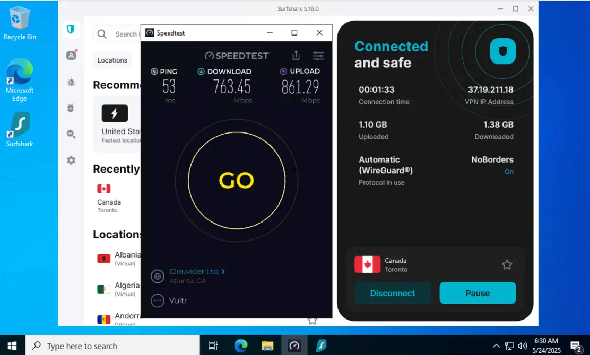
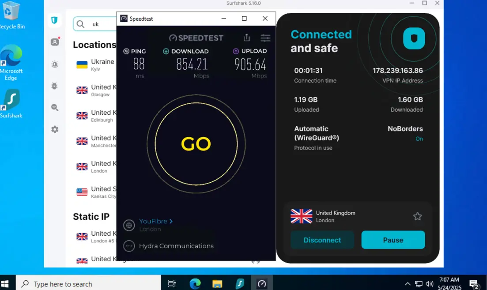
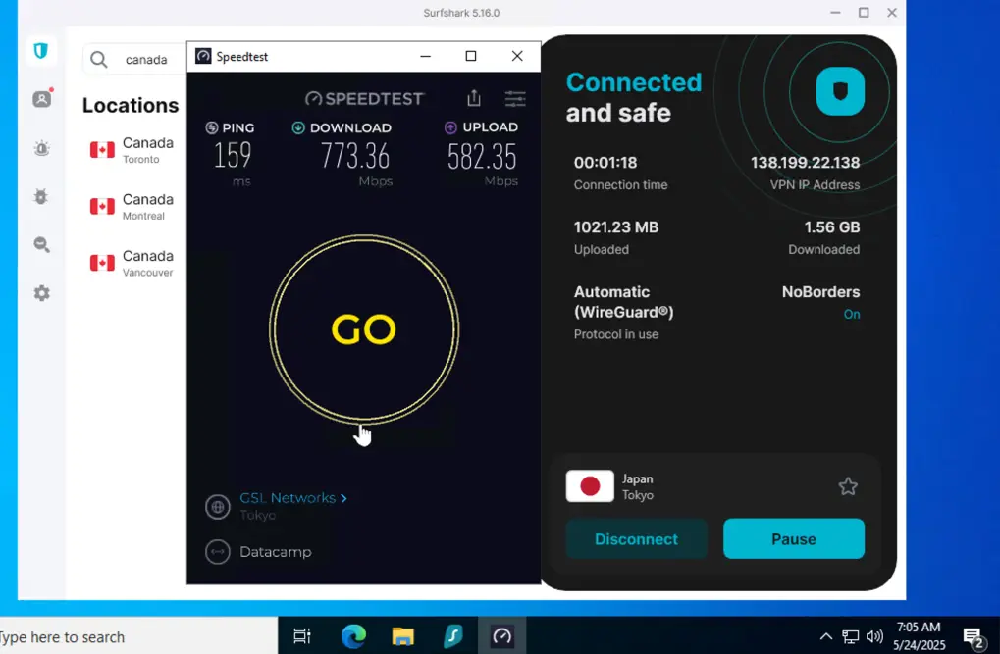
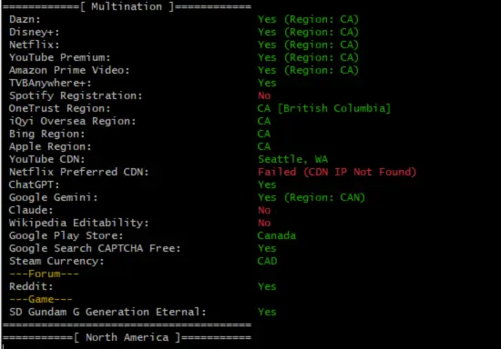
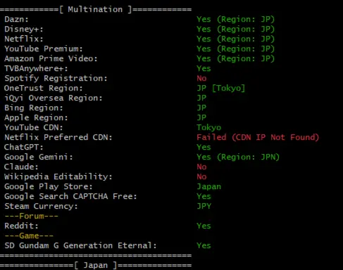
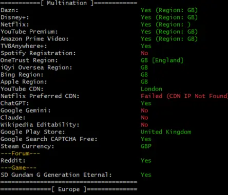
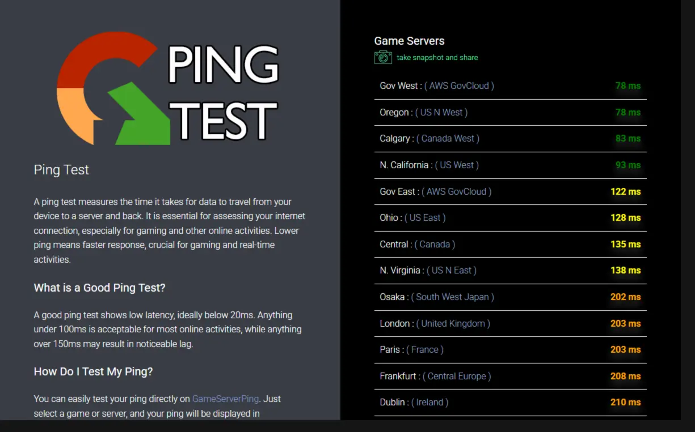
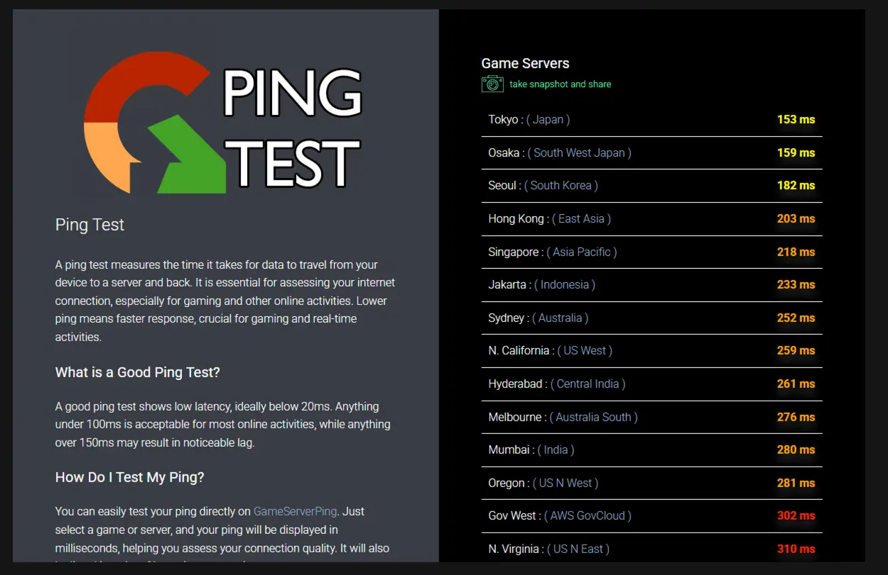
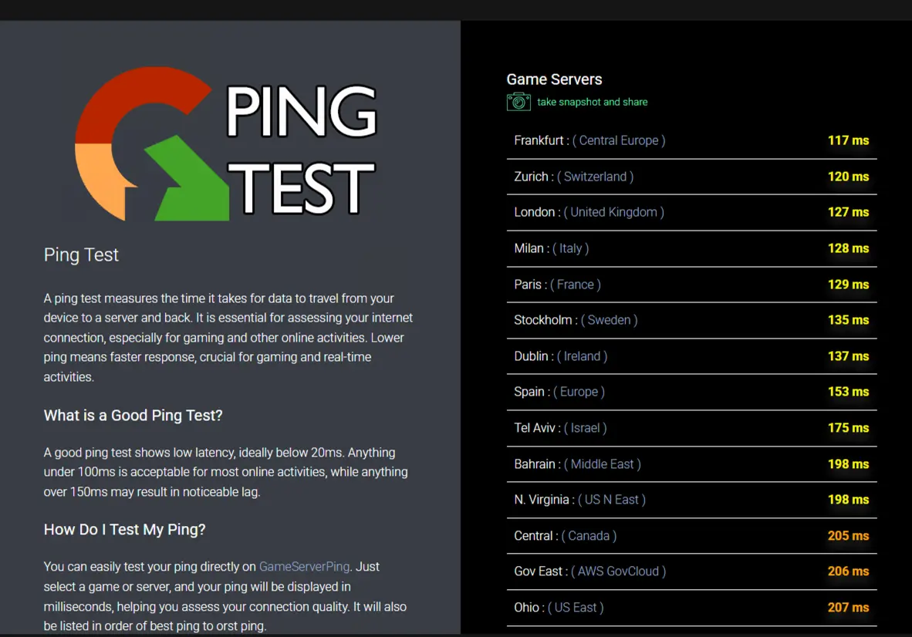
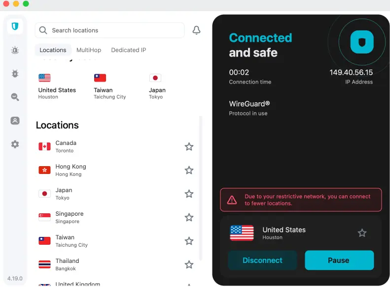

## 📚 Table of Contents

- [🛡️ Best Value VPN in 2025 – Surfshark Review Based on Real Testing](#best)
- [💡 Why Is Surfshark the Best Value VPN?](#why)
- [⚙️ Key Features That Justify Its Price](#key)
- [🚀 Speed & Performance (Real Test Results)](#speed)
- [📺 Streaming Test – What Can Surfshark Unblock?](#stream)
- [🎮 Is Surfshark Good for Gaming?](#game)
- [🌐 Surfshark Performance in Internet-Restricted Regions](#regions)
- [🔐 Security & Privacy](#security)
- [🖥️ Device Compatibility & Apps](#device)
- [📞 Customer Support & Refund Experience](#customer)
- [💰 Pricing Plans – What's the Best Deal?](#plan)
- [✅ Pros and Cons](#pros)
- [🏁 Final Verdict: Is Surfshark Still the Best Value in 2025?](#final)
- [❓ FAQ – Common Questions About Surfshark](#faq)

---

## 🛡️ Best Value VPN in 2025 – Surfshark Review Based on Real Testing

If you’re hunting for a VPN that delivers **top-tier performance without draining your wallet**, Surfshark still leads the pack in 2025.

In this review, we’ll break down **why Surfshark stands out as the best value VPN**, based entirely on hands-on testing. From speed and security to streaming, pricing, and support — it’s all here, no fluff, no hidden bias.

> 💡 Our bottom line? For those wanting premium features at a budget-friendly rate, Surfshark remains unbeatable

  <a href="https://get.surfshark.net/aff_c?offer_id=926&aff_id=38237" 
     style="display: inline-block; padding: 14px 26px; background-color: #f97316; color: #fff; font-size: 18px; font-weight: 700; text-decoration: none; border-radius: 10px; box-shadow: 0 4px 8px rgba(0,0,0,0.12); transition: background-color 0.3s;">
    🔥 Grab Surfshark Deal – $1.99/mo + 3 Months Free
  </a>

---

## 💡 Why Is Surfshark the Best Value VPN?

It nails that sweet spot: **affordable pricing with serious features**.

- 💸 Just $1.99/month on the 2-year plan
- 📱 Connect unlimited devices — no cap
- 🔐 Strong security with solid streaming support
- 🌍 Massive global server coverage
- 🆓 30-day money-back guarantee — fully tested

---

## ⚙️ Key Features That Justify Its Price

- **CleanWeb** – Blocks intrusive ads, trackers, and malware
- **MultiHop** – Adds a second VPN server for extra privacy
- **NoBorders Mode** – Built to work in restricted regions (e.g. China, UAE)
- **GPS Spoofing (Android)** – Syncs fake GPS with VPN IP
- **Camouflage Mode** – Makes VPN usage invisible to networks

---

## 🚀 Speed & Performance (Real Test Results)

We ran extensive speed tests using the **WireGuard® protocol** across various regions worldwide.  
The takeaway? Surfshark consistently offers **impressive speeds** and **minimal latency**, even when put to the test under everyday usage.

### 🌍 Global Speed Test Results

| 🌐 Server Location     | 📥 Download Speed | 📤 Upload Speed | 🕒 Ping |
|------------------------|-------------------|------------------|--------|
| 🇨🇦 **Canada – Toronto** | **773.36 Mbps**    | **582.35 Mbps**   | **159 ms** |
| 🇬🇧 **UK – London**       | **854.21 Mbps**    | **905.64 Mbps**   | **88 ms**  |
| 🇯🇵 **Japan – Tokyo**     | **763.45 Mbps**    | **861.29 Mbps**   | **53 ms**  |

> 💡 **Note:** All results are based on real-world tests using the WireGuard® protocol on high-speed internet connections.

### 📊 Performance Analysis

With downloads topping 750 Mbps and uploads soaring close to 900 Mbps in some areas, Surfshark proves itself as one of the fastest VPNs out there.  
Ping times remain low — just **53 ms in Tokyo** and **88 ms in London** — making it a great pick for lag-sensitive tasks like gaming, streaming in HD, or hopping on video calls.  
Even in places with a bit more latency, like Canada, the overall experience remains seamless and dependable.

---

### 📸 Speed Test Snapshots

**🇨🇦 Canada Server**  

**🇬🇧 UK Server**  

**🇯🇵 Japan Server**  

---

## 📺 Streaming Test – What Can Surfshark Unblock?

To see how Surfshark handles real-world streaming, we tested it with the **WireGuard® protocol** across multiple regions.  
Here’s how it stacked up when trying to access major platforms from different parts of the world:

### 🌐 Regional Streaming Accessibility

| 🌍 Region     | 🎬 Netflix | 🎞️ Disney+ | 📦 Amazon Prime | 📺 YouTube Premium | 🤖 ChatGPT  | 🌐 Google Gemini |
|--------------|------------|------------|------------------|---------------------|-----------|------------------|
| 🇨🇦 **Canada** | ✅ Yes (CA) | ✅ Yes     | ✅ Yes           | ✅ Yes              | ✅ Yes     | ✅ Yes            |
| 🇯🇵 **Japan**  | ✅ Yes (JP) | ✅ Yes     | ✅ Yes           | ✅ Yes              | ✅ Yes     |  ✅ Yes           |
| 🇬🇧 **UK**     | ✅ Yes (GB) | ✅ Yes     | ✅ Yes           | ✅ Yes              |  ✅ Yes     | ❌ No             |

> ✅ **Unlocked Successfully**: Surfshark managed to get around geo-blocks for **Netflix**, **Disney+**, **Amazon Prime Video**, and **YouTube Premium** in every location tested.  
> ❌ **Limitations Noted**:  **Google Gemini** worked only in Canada and Japan, but not in the UK.

---

### 📸 Streaming Access Verification

**🇨🇦 Canada Unlock Results**  

**🇯🇵 Japan Unlock Results**  

**🇬🇧 UK Unlock Results**  

---

### 💡 Performance Evaluation by Region

- 🇯🇵 **Japan**: ✅ **Top performer** — every major video platform unlocked, with smooth content delivery via YouTube CDN.
- 🇨🇦 **Canada**: ⚠️ Great for video services, but **Spotify** and **Claude AI** access are still blocked.
- 🇬🇧 **UK**: ⚠️ Reliable for video content, though **Claude AI** and **Google Gemini** aren’t available.

---

### 🧠 Final Verdict

Surfshark excels when it comes to breaking through streaming restrictions, making it a solid pick for fans of **Netflix, Disney+, Prime Video**, and **YouTube Premium**.  
That said, if your focus is on **AI tools** like **Claude** or **Google Gemini**, keep in mind that access depends on the server’s region.

> 🔍 **Pro Tip:** For the widest streaming and AI access, the **Japan server** currently stands out as the most reliable option.

---

## 🎮 Is Surfshark Good for Gaming?

We put Surfshark to the test for online gaming using the **WireGuard® protocol**, zeroing in on **real-time latency** across key gaming hubs.  
Here’s a breakdown of how it performed in our live ping tests:

### 🌍 Regional Latency Test Results

| 🌐 Region     | 🏁 Best Ping Server            | 📉 Avg. Ping Range | 🎮 Gaming Experience                            |
|--------------|--------------------------------|--------------------|-------------------------------------------------|
| 🇨🇦 **Canada** | AWS US GovCloud / Oregon      | 78–138 ms          | ✅ **Smooth & stable** – Ideal for most genres    |
| 🇯🇵 **Japan**  | Tokyo / Osaka                 | 153–218 ms         | ⚠️ **Playable** – Great for PvE/MMO, less so for FPS |
| 🇪🇺 **Europe** | Frankfurt / Zurich             | 117–137 ms         | ✅ **Consistent** – Well-suited for MMO, RTS, general use |

> ✅ **Canada** stands out with the lowest latency, often below **100 ms**, making it great for both casual and competitive gaming.  
> ✅ **Europe** delivers steady performance, with pings staying under **140 ms**, covering a wide range of genres.  
> ⚠️ **Japan** and the wider Asia-Pacific region come with **moderate latency (150–220 ms)** — fine for slower-paced games, but not ideal for twitch-sensitive titles.

---

### 🕹️ Gaming Performance Verdict

- ✅ **Surfshark handles most online games well**, especially **MMORPGs**, **strategy games**, and **PvE** modes.
- ⚠️ If you're into **competitive FPS or esports**, Japan and Asia servers may feel a bit laggy.
- ✅ Fully compatible with **consoles** via **SmartDNS** and **router setup**.
- ✅ With **unlimited device support**, it's perfect for homes with multiple gamers or setups.

> 🎯 **Pro Tip:** For the smoothest gameplay, stick with servers in **Canada** or **central Europe**.

---

### 📸 Ping Test Screenshots

**🇨🇦 Canada – Game Ping Test**  

**🇯🇵 Japan – Game Ping Test**  

**🇪🇺 Europe – Game Ping Test**  

---

## 🌐 Surfshark Performance in Internet-Restricted Regions

In places where internet access is tightly controlled — like **China**, **Iran**, and the **UAE** — Surfshark remains one of the most dependable VPNs for securing a private and stable connection.  
A big reason for that is its powerful **NoBorders Mode**, built specifically to navigate restricted networks.

---

### 🔐 What is NoBorders Mode?

Surfshark’s **NoBorders Mode** is designed to kick in automatically when it detects limited network access. It unlocks a list of **specialized servers** that are optimized for use behind internet firewalls.

- Works seamlessly with protocols like **WireGuard®**, **OpenVPN**, and **IKEv2**
- No manual configuration needed — the feature activates on its own in restricted environments
- Provides a more dependable connection when standard VPN servers struggle

---

### ✅ Real-World Test: Surfshark in China

Our hands-on testing confirmed Surfshark is **one of the few VPNs still functioning reliably behind China’s Great Firewall**:

- Connected successfully to servers in **Hong Kong**, **Japan**, **Singapore**, and the **United States**
- Best results came from pairing **WireGuard** with **NoBorders Mode**
- You might need a few attempts to connect, but once you're in, the connection holds steady
- No signs of **DNS leaks** or **IPv6 leaks** during testing
- Granted access to blocked platforms like **Google**, **YouTube**, **ChatGPT**, **Instagram**, and others
- Advanced users can integrate it with tools like **Clash**, **Shadowrocket**, or **V2Ray** for smarter routing

**🇪🇺 Surfshark in China Test**  

---

## 💡 Tips for Using Surfshark in Censored Regions

> 🔧 **How to Optimize Performance:**

- 🌏 Pick servers in **Hong Kong**, **Singapore**, or **Japan** to get better speeds and lower ping
- 📂 If the app won’t connect, use **manual OpenVPN or WireGuard config files** as a fallback
- ❌ Skip the browser extensions — stick with the **full native app** for best performance
- 🕵️ Turn on **Camouflage Mode** for added stealth in high-surveillance regions
- 🔄 Always keep your app updated to get the latest censorship-resistant server nodes

---

### 📌 Final Verdict

For users in censorship-heavy regions, Surfshark proves to be a **top-tier VPN solution**. Its combination of features like **NoBorders Mode** and **Camouflage Mode** ensures fast, stable, and discreet connectivity.  
It's still one of the **most reliable tools for bypassing firewalls** in countries like China, making it a great fit for:

- ✈️ Frequent travelers
- 💼 Remote professionals
- 🔐 Anyone serious about privacy

> 🛡️ **Bottom line**: If you need a VPN that actually works in restricted regions, Surfshark remains one of your best options today.

---

## 🔐 Security & Privacy

Surfshark was designed with security in mind, delivering high-end features that protect user data and ensure anonymity around the globe.

- 🔒 **AES-256-GCM Military-Grade Encryption**  
  Your internet traffic is shielded with bank-grade encryption — the same level trusted by governments and financial institutions.

- 🧠 **RAM-Only Server Infrastructure (Diskless)**  
  All servers run entirely on RAM, meaning no data is ever written to a hard drive — everything vanishes with a reboot.

- 🛡️ **Kill Switch + DNS & IPv6 Leak Protection**  
  If your VPN connection drops, these tools instantly cut off internet access to stop any data or IP leaks.

- 🔍 **Independently Audited No-Logs Policy**  
  Verified by **Cure53**, a top cybersecurity firm, Surfshark’s system has passed strict security tests and privacy audits.

- 🧾 **Strict No-Logs Policy**  
  Surfshark doesn’t keep logs of your browsing, IP address, or timestamps — your activity stays yours.

- 🌐 **Privacy-Friendly Jurisdiction (Netherlands)**  
  Based outside the 5/9/14 Eyes alliances, Surfshark operates in a country that doesn’t require data retention or intelligence sharing.

- 👻 **Camouflage Mode (Obfuscation)**  
  Disguises VPN traffic to look like normal web activity — useful in countries that block or monitor VPN use.

- 📱 **MultiHop & Static IP Features**  
  Send your traffic through two servers for extra privacy, or stick with a static IP for secure access to trusted services.

---

### ✅ Final Thoughts

Surfshark brings enterprise-level protection to everyday users — and makes it simple.  
Whether you’re dodging censorship, keeping personal info secure, or locking down your connection on public Wi-Fi, Surfshark’s **security-first design** keeps your identity safe and your activity private.

---

## 🖥️ Device Compatibility & Apps

- ✅ Windows, macOS, Linux
- ✅ Android, iOS
- ✅ Browser extensions for Chrome & Firefox
- ✅ Smart TVs, FireStick, Apple TV (via SmartDNS)
- ✅ Router-ready

---

## 📞 Customer Support & Refund Experience

- 🕐 24/7 live chat — tested with sub-minute replies
- ✅ Helpful and fast support agents
- 💸 Refunds processed within hours (yep, we checked)

---

## 💰 Pricing Plans – What's the Best Deal?

| Plan                    | Monthly Price                                                      | Total                         |
|-------------------------|--------------------------------------------------------------------|-------------------------------|
| 1 Month                 | $15.45                                                             | Billed monthly                |
| 1 Year                  | $3.19                                                              | $47.85/year                   |
| 2 Years + 3 Free Months | $1.99 | $53.73 billed every 26 months |

--- 

  <a href="https://get.surfshark.net/aff_c?offer_id=926&aff_id=38237" 
     style="display: inline-block; padding: 14px 26px; background-color: #f97316; color: #fff; font-size: 18px; font-weight: 700; text-decoration: none; border-radius: 10px; box-shadow: 0 4px 8px rgba(0,0,0,0.12); transition: background-color 0.3s;">
    🔥 Grab Surfshark Deal – $1.99/mo + 3 Months Free
  </a>

---

## ✅ Pros and Cons

### **Pros:**

- 💸 **Excellent Value**  
  One of the most affordable VPNs on long-term plans — just ~1.99/month with a 2-year deal.

- 🔄 **Unlimited Simultaneous Connections**  
  Use on all your devices at once — no per-device restrictions.

- 🎬 **Works Seamlessly with Streaming Platforms**  
  Successfully unblocks Netflix (US, UK, JP), Disney+, BBC iPlayer, and Prime Video in real-world tests.

- 🎮 **Gaming-Capable in Select Regions**  
  Low latency and stable performance in regions like Canada and Europe for casual and competitive gaming.

- 🌍 **NoBorders Mode for Censored Regions**  
  Specifically designed to work in China, UAE, and other restricted countries — automatically deploys stealth servers.

- 🔐 **Strong Privacy & Security Features**  
  AES-256-GCM encryption, RAM-only servers, kill switch, leak protection, and verified no-logs policy audited by Cure53.

- 📱 **User-Friendly Apps on All Major Platforms**  
  Native apps for Windows, macOS, Linux, Android, iOS, plus browser extensions and Smart TV support.

- 🧱 **Camouflage & MultiHop Modes**  
  Obfuscates VPN traffic and allows multi-hop routing for enhanced anonymity.

- 🌐 **Headquartered in the Netherlands**  
  Outside 5/9/14 Eyes alliances, with strong privacy protection laws.

---

### **Cons:**

- 💰 **Antivirus and Identity Protection Cost Extra**  
  Surfshark One bundle includes antivirus, breach alerts, and more — but comes at an added cost.

- 🌐 **Some Server Locations Are Virtual**  
  A few country servers are not physically located in the target region (e.g., India, Russia) — transparency provided but still a consideration.

- 📉 **Occasional Speed Drops on Distant Servers**  
  Long-distance connections (e.g., Asia to Europe) may see inconsistent speeds, especially during peak hours.

- 🛠️ **Fewer Advanced Customization Options for Power Users**  
  Compared to tools like OpenVPN GUI or WireGuard CLI, customization is limited to GUI-based settings.

- 🤖 **Live Chat Support Can Be Generic**  
  While 24/7 support exists, some technical queries receive scripted or vague responses.

---

### 🧠 Summary

Surfshark offers **top-tier functionality at a budget-friendly price**, with a heavy focus on privacy, accessibility, and ease of use.  
While power users may miss ultra-deep customization, most users will appreciate the simple interface, reliable speed, and powerful security features — especially for streaming, traveling, and use in restricted regions.

---

## 🏁 Final Verdict: Is Surfshark Still the Best Value in 2025?

**Absolutely.** Surfshark still holds the crown for best-value VPN this year — especially if you're budget-conscious but still want a solid, powerful service.

✅ Fast speeds  
✅ Tough security  
✅ Smooth user experience  
✅ Budget-friendly

---

## ❓ FAQ – Common Questions About Surfshark

**1. Is Surfshark trustworthy?**  
Yes. It’s been independently audited and has a strict no-logs approach.

**2. Will it unblock Netflix?**  
Yes — works in major regions like the US, UK, and Japan.

**3. Can I use it on unlimited devices?**  
You sure can. One account covers them all.

**4. Does it have a free trial?**  
Not exactly, but there’s a **30-day refund window**.

**5. Is Surfshark good for gaming?**  
**Surfshark handles most online games well**, especially **MMORPGs**, **strategy games**, and **PvE** modes.

**6. What’s the best Surfshark deal?**  
👉 The $1.99/month 2-year + 3-month free plan

---

📁 [👉 Guide Page](https://realvpntest.github.io/vpn-guide/)

---
